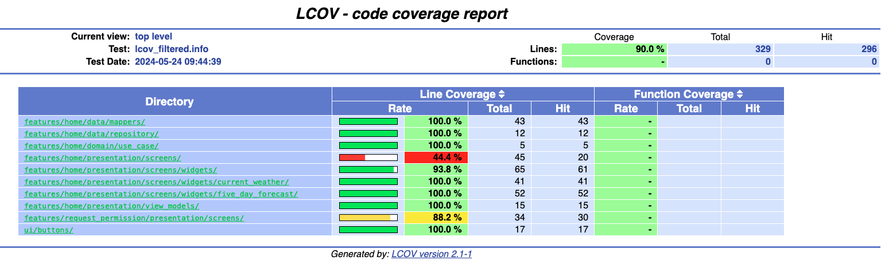
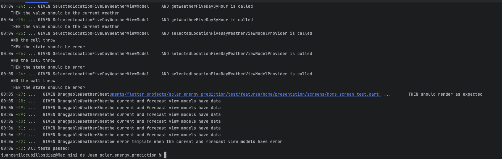
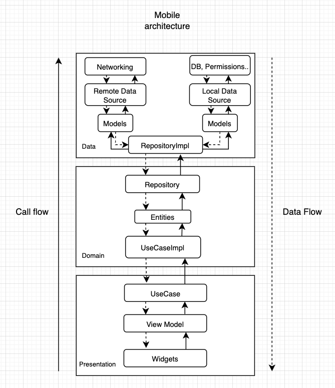
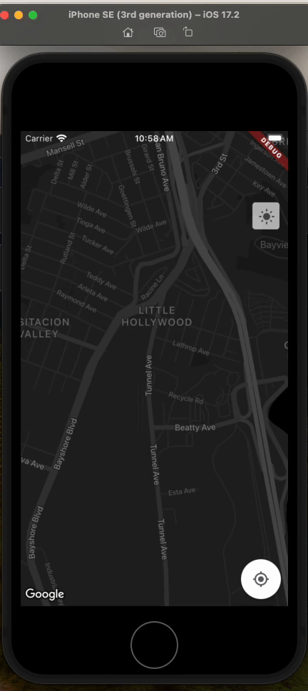

# Flutter Challenge: Current weather and forecast with Interactive Map

Hi there! welcome to the current weather and forecast interactive app made with Flutter, this is a
test for Flutter mobile developer position for Stori.

## Challenge description

Develop a Flutter application that allows users to select a location on a map and obtain the weather
for that location using OpenWeatherMap APIs.
The application should display the current weather and the weather forecast for the next 5 days for
the selected location.

## Getting Started 🚀


1. To run the project run the following command to generate files:

```sh
$ flutter clean

$ flutter pub get

$ dart run build_runner build --delete-conflicting-outputs

```

2. Rename .env.template to .env and set your openWeatherKey api in this key WEATHER_API_KEY


## Running Tests 🧪

To run all unit and widget tests use the following command:

```sh
$ flutter test --coverage
```
To view the generated coverage report you can use [lcov](https://github.com/linux-test-project/lcov).

```sh
lcov --remove coverage/lcov.info \                  
    'networking/*' \
    'core/*' \
    '*_service.dart' \
    '*data_source.dart' \
    '*data_source_remote.dart' \
    '*entity.dart' \
    '*response.dart' \
    '*api_source.dart' \
    '*use_case_provider.dart' \
    '*.g.dart' \
    -o coverage/lcov_filtered.info
    
genhtml coverage/lcov_filtered.info -o coverage/html    

open coverage/html/index.html 
```






## Architecture used

1. This is a Flutter weather app with clean architecture,MVVM, SOLID principles, feature-first as
   project Structure and Riverpod as State management.



2. Libraries:
- **location**: Provides functions for accessing device location, such as latitude and longitude, as well as for requesting location permissions.
- **google_maps_flutter**: Allows integration of Google Maps into Flutter applications, enabling interactive maps display and customization as needed.
- **flutter_riverpod**: A state management library that provides a simple and elegant way to handle dependency management and state in Flutter applications.
- **dio**: An HTTP client for Dart and Flutter that makes it easy to make HTTP requests and handle responses efficiently.
- **retrofit**: A library for declaratively creating HTTP clients in Dart and Flutter, simplifying the consumption of REST APIs.
- **flutter_dotenv**: Allows loading environment variables from a .env file in Flutter applications, making it easy to manage sensitive configurations and development settings.
- **freezed_annotation**: A library for generating boilerplate code in Dart and Flutter, simplifying the creation of immutable classes and data serialization.
- **json_annotation**: Facilitates serialization and deserialization of JSON objects in Dart and Flutter by generating code.
- **cached_network_image**: Provides a cached network image widget that caches downloaded images to improve performance and reduce bandwidth usage.
- **intl**: Provides functions for internationalization and localization of Flutter applications, enabling text translation and adaptation to different regions and languages.
- **google_fonts**: Facilitates integration of Google fonts into Flutter applications, allowing the use of a wide variety of fonts available on Google Fonts.
- **url_launcher**: Allows opening URLs in the device's default web browser from a Flutter application, making it easy to navigate to external websites.
- **permission_handler**: Provides functions for requesting and managing permissions in Flutter applications, allowing access to sensitive device features such as location and camera.
- **mockito**:  A library for creating mocks in Dart and Flutter unit tests, making it easy to simulate behaviors and test components in isolation.

3. This project contains unit and widget test.

### Dev dependencies 

- **flutter_lints**: Provides a set of lint rules for Flutter projects to enforce coding style and best practices.
- **build_runner**: A command-line tool that builds files from generators (like the json_serializable and retrofit_generator mentioned below) and manages the code generation process in Dart and Flutter projects.
- **freezed**: A code generation package that generates immutable classes and serializers for Dart and Flutter applications, helping to reduce boilerplate code when working with immutable data structures.
- **json_serializable**: Generates code for JSON serialization and deserialization in Dart and Flutter, simplifying the process of converting Dart objects to and from JSON.
- **retrofit_generator**: Generates code for Retrofit clients in Dart and Flutter, making it easier to consume REST APIs by generating code for HTTP requests and responses.

## Project structure 

### Data layer:
- Contains the entity classes that represent the data of the problem domain.
- Also contains the repositories that provide access to the data.
- 
### Domain layer:
- Contains the use case classes that represent the operations that can be performed on the problem domain.

### Presentation layer:
- Contains the widgets that are displayed in the user interface.
### ViewModel:
- Connects the presentation layer with the domain layer.
- Gets the data from the repository and exposes it to the presentation layer.
- 
### Additional explanation:
- The project architecture follows the MVVM (Model-View-ViewModel)  pattern.
- This pattern separates the UI logic from the domain logic.
- This makes the project easier to maintain and test.
- 
### Benefits of this structure:
- Modularity: The layers are decoupled from each other, which makes it easier to maintain and reuse code.
- Testability: Each layer can be tested independently, which makes it easier to detect and fix bugs.
- Scalability: The project structure can be easily extended to accommodate new features and requirements.

### Networking layer:
- Responsible for handling all network communication.
- This includes making HTTP requests, handling responses, and managing network connectivity.
- In this case, the networking layer contains the NetworkClient class.
### Core layer:
- Contains utility classes and functions that are used throughout the application.
- This can include things like data models, constants, and helper functions.
- 
### Explanation:
- The networking layer and core layer are both considered to be cross-cutting concerns.
- This means that they are used by multiple other layers in the application.
- By separating these concerns into their own layers, it makes it easier to maintain and test the application.

- Benefits of having separate networking and core layers:
- Modularity: The layers are decoupled from each other, which makes it easier to maintain and reuse code.
- Testability: Each layer can be tested independently, which makes it easier to detect and fix bugs.
- Scalability: The layers can be easily extended to accommodate new features and requirements.

## Demo:

1. iPhone small device



2. Android
   


3. Permissions


